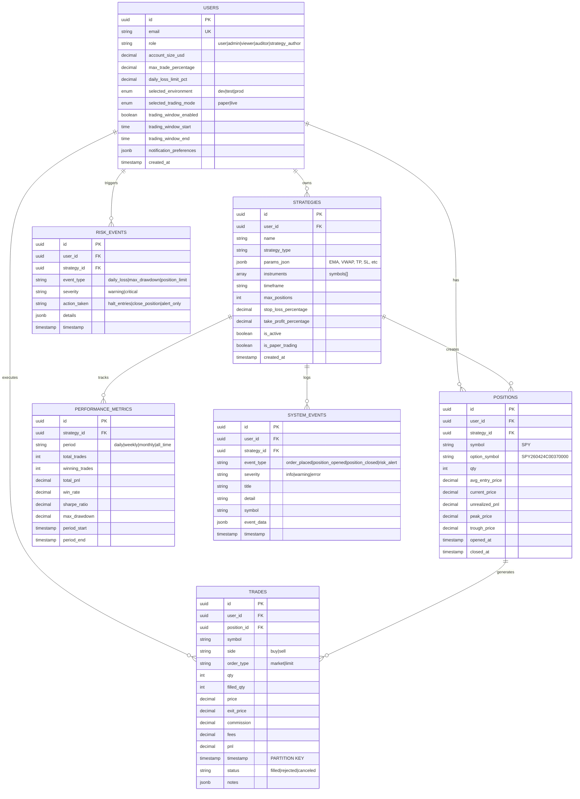
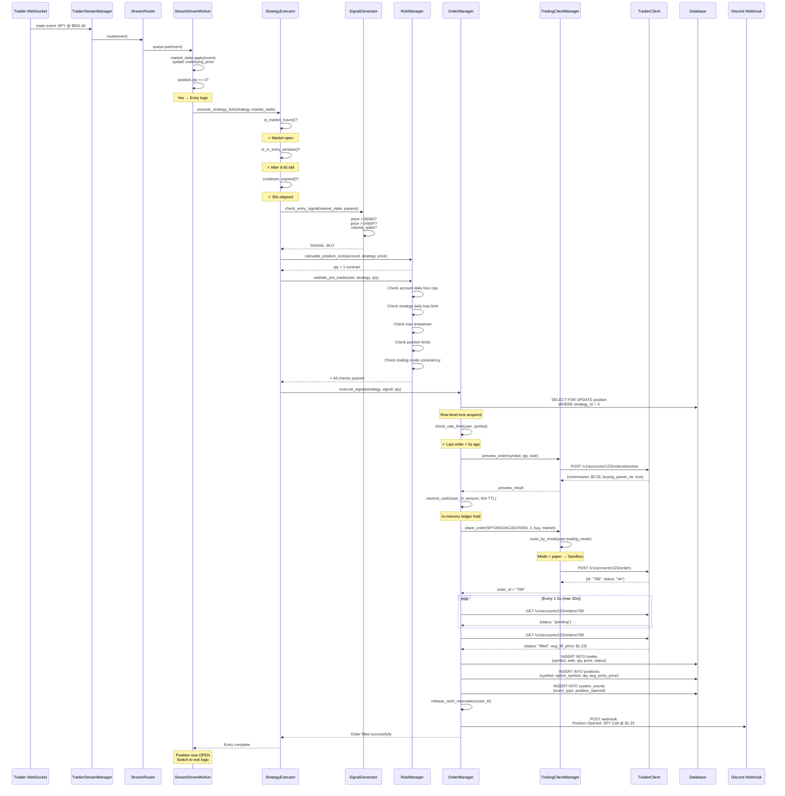
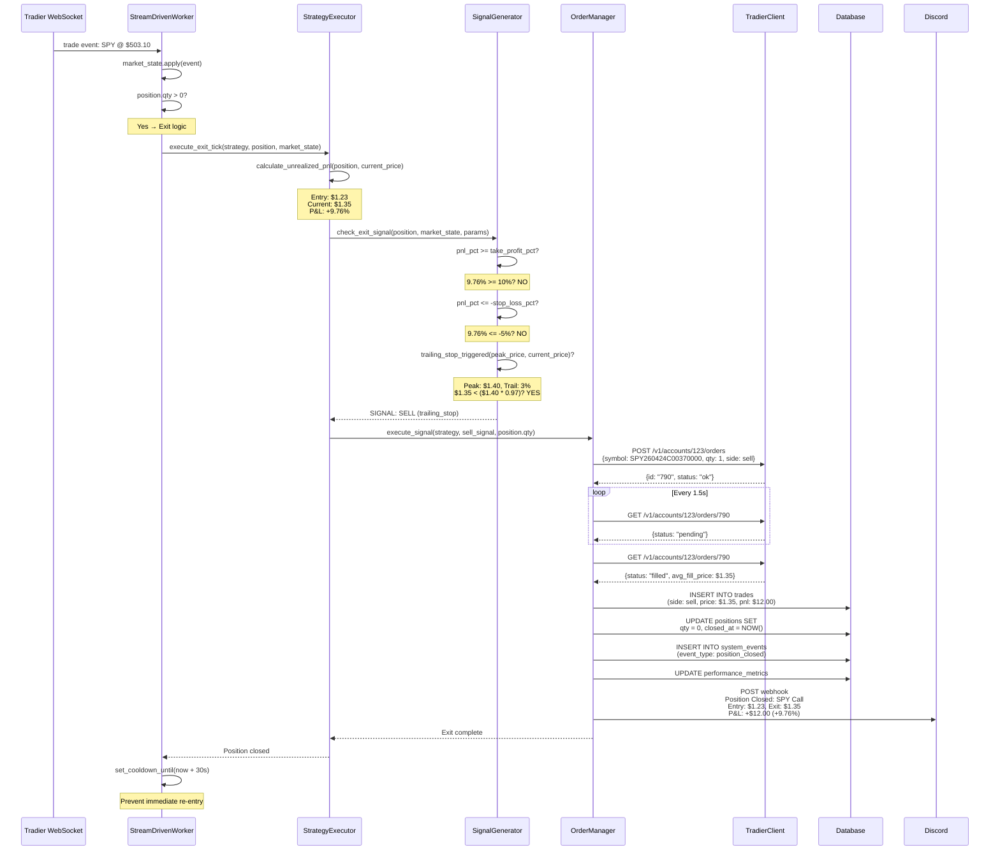
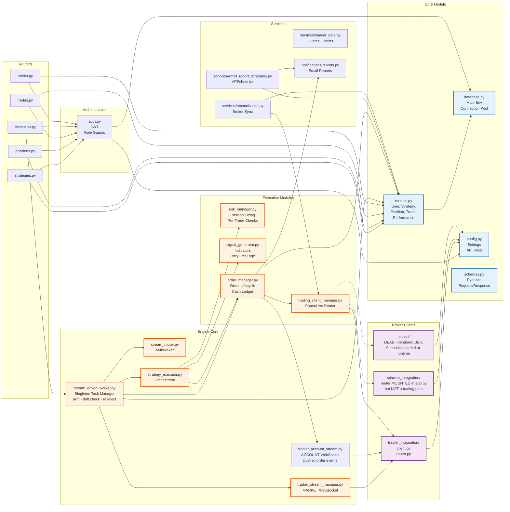
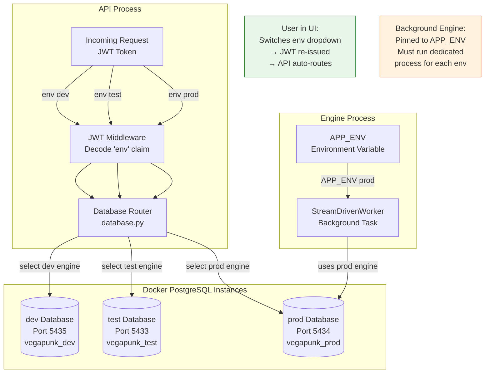
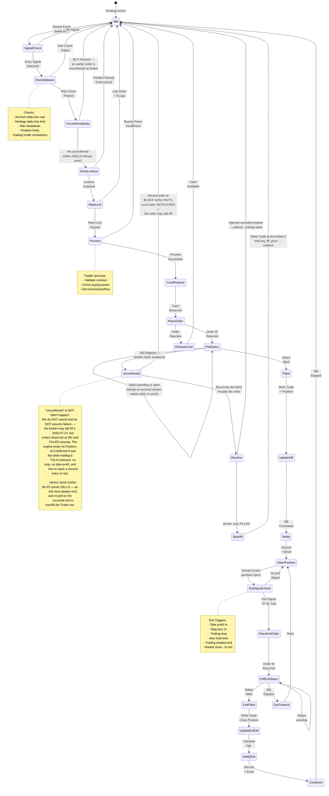
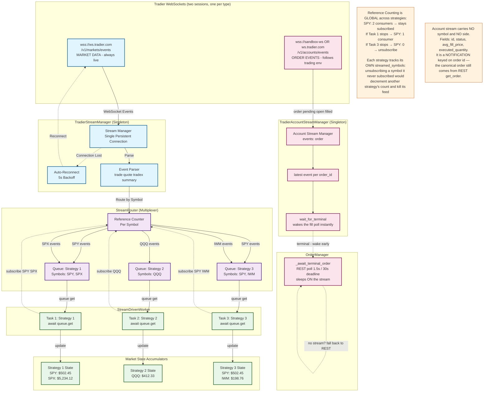
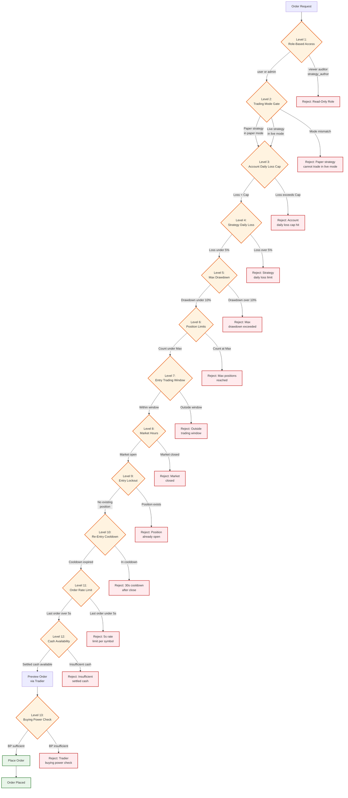

# VegaPunkR Architecture - Visual Diagrams

## 1. High-Level System Architecture

```mermaid
graph TB
    subgraph "Client Layer"
        UI[Angular 20 UI<br/>Dashboard, Strategies,<br/>Positions, Trades,<br/>Performance, Admin]
    end

    subgraph "API Layer - FastAPI"
        AUTH[Auth Router<br/>Login/Register/JWT]
        STRAT[Strategies Router<br/>CRUD + Toggle]
        POS[Positions Router<br/>View + Close]
        TRADE[Trades Router<br/>History]
        PERF[Performance Router<br/>Metrics + Equity]
        ADMIN[Admin Router<br/>User Management]
        SYS[System Router<br/>Environment Switch]
        EXEC[Execution Router<br/>Start/Stop]
    end

    subgraph "Trading Engine - Event Driven"
        SDW[StreamDrivenWorker<br/>Persistent Tasks<br/>Per Strategy]
        TSM[TradierStreamManager<br/>Single WebSocket<br/>wss://ws.tradier.com]
        SR[StreamRouter<br/>Multiplexer<br/>Ref-Counted Queues]

        subgraph "Execution Pipeline"
            SE[StrategyExecutor<br/>Orchestrator]
            RM[RiskManager<br/>Position Sizing<br/>Pre-Trade Validation]
            SG[SignalGenerator<br/>EMA, VWAP, Volume<br/>Entry/Exit Logic]
            OM[OrderManager<br/>Preview → Place<br/>Poll → DB Write]
        end
    end

    subgraph "Broker Integrations"
        TCM[TradingClientManager<br/>Paper OR Live Router<br/>BOTH return TradierClient]
        TC[TradierClient<br/>REST + WebSocket<br/>THE ONLY LIVE BROKER]
        ASM[TradierAccountStream<br/>order events - pushed fills]
        SC[SchwabClient<br/>NOT a trading path -<br/>TCM never returns it.<br/>OAuth router still mounted]
        AC[AlpacaClient<br/>DEAD - removed from<br/>the import graph 2026-07-13]
    end

    subgraph "Data Layer"
        DB[(PostgreSQL<br/>TimescaleDB<br/><br/>3 Databases:<br/>dev:5435<br/>test:5433<br/>prod:5434)]
    end

    subgraph "External Services"
        TRADIER[Tradier API<br/>Sandbox + Live]
        SCHWAB[Schwab API<br/>OAuth]
        DISCORD[Discord Webhooks<br/>Notifications]
        EMAIL[Resend Email API<br/>Reports]
    end

    subgraph "Background Services"
        EMAILSCHED[Email Report Scheduler<br/>APScheduler<br/>Daily/Weekly/Monthly]
        RECON[Reconciliation Service<br/>60s Forced Sync]
    end

    %% Client connections
    UI -->|REST API| AUTH
    UI -->|REST API| STRAT
    UI -->|REST API| POS
    UI -->|REST API| TRADE
    UI -->|REST API| PERF
    UI -->|REST API| ADMIN
    UI -->|REST API| SYS
    UI -->|REST API| EXEC

    %% Router to Engine
    STRAT -.->|start strategy| SDW
    EXEC -.->|start stop| SDW

    %% Engine flow
    TSM -->|Events| SR
    SR -->|Per-Strategy Queue| SDW
    SDW -->|Entry Exit Tick| SE
    SE -->|1. Check Risk| RM
    SE -->|2. Check Signal| SG
    SE -->|3. Execute Order| OM
    OM -->|Route Order| TCM

    %% Broker routing — paper vs live is Tradier SANDBOX vs Tradier LIVE.
    %% TradingClientManager is not a broker abstraction: both branches return TradierClient.
    TCM -->|Paper Mode - sandbox| TC
    TCM -->|Live Mode - live| TC
    TCM -.->|dead branch| SC
    TCM -.->|dead branch| AC

    %% External calls
    TC <-->|REST| TRADIER
    OM -->|await fill| ASM
    ASM <-->|WebSocket - account events| TRADIER
    TSM <-->|WebSocket - market events| TRADIER
    SC <-.->|REST - OAuth router only,<br/>no order placement| SCHWAB

    %% Database
    AUTH ---|Read Write Users| DB
    STRAT ---|Read Write Strategies| DB
    POS ---|Read Write Positions| DB
    TRADE ---|Read Write Trades| DB
    PERF ---|Read Performance| DB
    SDW ---|Read Write Positions| DB
    OM ---|Write Trades Positions| DB
    EMAILSCHED ---|Read Trades Performance| DB

    %% Notifications
    OM -.->|Position Events| DISCORD
    EMAILSCHED -.->|Scheduled Reports| EMAIL

    %% Background
    SDW -.->|60s Interval| RECON

    classDef engine fill:#e1f5ff,stroke:#01579b,stroke-width:2px
    classDef broker fill:#fff3e0,stroke:#e65100,stroke-width:2px
    classDef db fill:#f3e5f5,stroke:#4a148c,stroke-width:2px
    classDef external fill:#e8f5e9,stroke:#1b5e20,stroke-width:2px

    class SDW,TSM,SR,SE,RM,SG,OM engine
    class TCM,TC,SC,AC broker
    class DB db
    class TRADIER,SCHWAB,DISCORD,EMAIL external
```

## 2. Database Schema & Relationships

## 3. Trading Execution Flow (Entry Signal → Filled Order)

## 4. Exit Signal Flow (Open Position → Close)

## 5. Component Dependency Graph

## 6. Multi-Environment Database Routing

## 7. Order Lifecycle State Machine

## 8. WebSocket Stream Architecture

**Two independent streams run concurrently.** Tradier's "one session at a time" limit is
stated per stream-*type* — market and account each have their own session endpoint and
socket — so both coexist. Verified against sandbox 2026-07-13.

- **Market stream** (`tradier_stream_manager.py`) — price/quote ticks. Always LIVE endpoint;
  sandbox has no market-data WS host.
- **Account stream** (`tradier_account_stream.py`) — order lifecycle events. Uses the
  *trading* env, so paper mode connects to `sandbox-ws.tradier.com`. Exists so fills are
  **pushed** rather than polled: on 2026-07-13 two orders filled while the engine's 30s
  `get_order` poll expired, leaving it holding 6 contracts it had no record of.

The account stream is an **accelerator, not a replacement** — REST polling remains the
fallback, so if it drops the engine behaves exactly as it did before.

## 9. Risk Management Hierarchy

## 10. Frontend Angular Architecture

> **Performance page P&L comes from `StrategyService.getClosedTrades()`
> (`GET /performance/closed-trades`), NOT from Tradier's `/gainloss`.**
> That report's FIFO lot matcher does not retire closed buy lots when a contract is
> round-tripped repeatedly, so on 2026-07-13 it reported **−$21,057** for a day that
> actually lost **−$1,851**. It is also paginated, so a busy day was truncated on top of
> being wrong. The engine's own `Trade` rows pair each exit with the entry that opened
> it, at fill time — correct by construction, no lot matching required.
> Period selector now includes **1D** (`DAY`); Tradier has no DAY bucket for historical
> balances, so `getHistoricalBalances()` sends `WEEK` and the day filtering happens on
> the closed positions.

```mermaid
graph TB
    subgraph "Angular 20 UI"
        subgraph "Pages (Lazy Loaded)"
            DASH[Dashboard Page<br/>Account Balance<br/>Risk Status Tile<br/>Open Positions<br/>Recent Trades<br/>Equity Curve]
            STRAT[Strategies Page<br/>Strategy List<br/>Template Gallery<br/>Create/Edit Forms<br/>Toggle Active<br/>Stream Drawer]
            POS[Positions Page<br/>Open Positions Table<br/>Close Position Action<br/>Position Chart Dialog]
            TRADES[Trades Page<br/>Trade History Table<br/>Date/Symbol Filters]
            PERF[Performance Page<br/>Equity Curve<br/>P&L Summary<br/>Win Rate<br/>Sharpe Ratio]
            ADMIN[Admin Page<br/>User Management<br/>Create/Edit/Delete<br/>Role Assignment]
        end

        subgraph "Services"
            AUTHS[AuthService<br/>Login/Register<br/>JWT Token Manager<br/>Role Guards]
            STRATS[StrategyService<br/>CRUD Strategies<br/>Equity Curves<br/>getClosedTrades - P&amp;L SOURCE]
            ACCTS[AccountService<br/>Fetch Balance<br/>Positions<br/>Trades]
            TRAD[TradierService<br/>Proxy to Tradier<br/>Quotes<br/>Option Chains]
            SCH[SchwabService<br/>OAuth Redirect<br/>Account Info]
            SYS[SystemService<br/>Environment Switch<br/>System Events Stream]
            STRM[MarketStreamService<br/>WebSocket to Tradier<br/>Live Quotes for UI]
            RISK[RiskService<br/>Risk Status<br/>Account Daily Loss]
        end

        subgraph "Guards"
            AG[AuthGuard<br/>JWT Validation]
            RG[RoleGuard<br/>Admin-Only Routes]
        end

        subgraph "Components"
            ENV[Environment Controls<br/>Dev/Test/Prod Toggle<br/>Paper/Live Toggle]
            PROF[Profile Dialog<br/>User Settings<br/>Trading Windows<br/>Notification Prefs]
            RISK_TILE[Risk Status Tile<br/>Daily Loss Progress Bar<br/>OK/WARNING/HALTED]
        end
    end

    subgraph "Backend API"
        API[FastAPI<br/>/api/v1/*]
    end

    %% Page to Service connections
    DASH --> ACCTS
    DASH --> RISK
    DASH --> SYS

    STRAT --> STRATS
    STRAT --> TRAD
    STRAT --> STRM

    POS --> ACCTS
    TRADES --> ACCTS
    PERF --> ACCTS
    ADMIN --> AUTHS

    %% Service to API
    AUTHS --> API
    STRATS --> API
    ACCTS --> API
    TRAD --> API
    SCH --> API
    SYS --> API
    RISK --> API

    %% Guards
    DASH -.->|protected| AG
    STRAT -.->|protected| AG
    POS -.->|protected| AG
    TRADES -.->|protected| AG
    PERF -.->|protected| AG
    ADMIN -.->|protected + admin only| RG

    %% Components
    DASH --> ENV
    DASH --> RISK_TILE
    DASH --> PROF

    classDef page fill:#e3f2fd,stroke:#1565c0,stroke-width:2px
    classDef service fill:#fff3e0,stroke:#e65100,stroke-width:2px
    classDef component fill:#f3e5f5,stroke:#6a1b9a,stroke-width:2px

    class DASH,STRAT,POS,TRADES,PERF,ADMIN page
    class AUTHS,STRATS,ACCTS,TRAD,SCH,SYS,STRM,RISK service
    class ENV,PROF,RISK_TILE component
```

---

## Key Design Patterns Summary

| Pattern | Implementation | Purpose |
|---------|---------------|---------|
| **Singleton Managers** | `StreamDrivenWorker`, `TradierStreamManager`, `TradingClientManager` | Single global instance coordinates all strategies |
| **Event-Driven Architecture** | WebSocket → Queue → Executor | Real-time stream processing, no polling |
| **Ref-Counted Subscriptions** | `StreamRouter` tracks consumers per symbol | Automatic subscribe/unsubscribe management |
| **Row-Level Locking** | `SELECT FOR UPDATE` on positions | Prevent race conditions on concurrent signals |
| **Optimistic Polling** | Poll Tradier for terminal status before DB write | Fail-safe against partial fills |
| **In-Memory Cash Ledger** | Temporary holds with TTL | Prevent double-spend on concurrent orders |
| **Re-Entry Cooldown** | 30s lockout after close | Prevent flip-flop trading loops |
| **Multi-Environment DB Routing** | 3 separate PostgreSQL instances | Complete data isolation (dev/test/prod) |
| **Role-Based Access Control** | JWT claims + FastAPI dependencies | Fine-grained permissions (user/admin/viewer/auditor) |
| **Strategy Market State** | Per-strategy accumulator of stream events | Maintain real-time pricing, greeks, volume |

---

## Performance & Scale Characteristics

- **Latency**: Stream tick → Order placed: ~50-150ms (network-dependent)
- **Throughput**: Single WebSocket handles 100+ symbols simultaneously
- **Concurrency**: Supports 10+ active strategies per process
- **Database**: TimescaleDB hypertable partitions trades by timestamp
- **Live-Test Logging**: JSONL append-only logs for post-trade analysis
- **Fail-Safe**: Auto-reconnect on WebSocket disconnect (5s backoff)
- **Recovery**: Startup reconciliation syncs DB against Tradier positions

---

*Generated: 2026-07-11*
*Codebase: VegaPunkR Options Trading Automation Platform*
