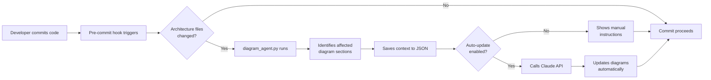

# Architecture Diagram Maintenance System

## Overview

This system automatically keeps your architecture diagrams in sync with code changes using **pre-commit hooks** and a **diagram update agent**.

## How It Works



## Components

### 1. Mermaid Syntax Validator (`scripts/validate_mermaid.py`)

**Automatically checks for syntax errors** before diagrams are committed!

Catches common issues:
- ✅ Parentheses in edge labels: `|start_strategy()| → |start strategy|`
- ✅ Forward slashes: `|R/W Users| → |Read Write Users|`
- ✅ Colons with quotes: `|env: "dev"| → |env dev|`
- ✅ Method calls: `|queue.get| → |queue get|`
- ✅ Pipes in node labels: `[trade|quote] → [trade quote]`
- ✅ State diagram issues: `Status:<br/>pending/open → Status<br/>pending or open`

**Run manually:**
```bash
python3 scripts/validate_mermaid.py docs/architecture-diagram.md
```

**Auto-runs on commit** (via pre-commit hook)

### 2. Pre-commit Hook (`.pre-commit-config.yaml`)

Monitors these file patterns:
- `api/models.py` → Database schema diagrams
- `api/routers/*.py` → API architecture diagrams
- `api/engine/*.py` → Execution flow diagrams
- `api/tradier_integration/*.py` → Integration diagrams
- `api/schwab_integration/*.py` → Integration diagrams
- `ui/src/app/**/*.ts` → Frontend architecture diagrams

### 2. Diagram Agent (`scripts/diagram_agent.py`)

**Runs on every commit** to detect diagram updates needed.

Maps changed files to affected diagram sections:
- Database Schema & Relationships
- Trading Execution Flow
- WebSocket Stream Architecture
- Risk Management Hierarchy
- Frontend Angular Architecture
- And more...

### 3. Update Helper (`scripts/update_diagrams.py`)

Provides guidance and automation for updating diagrams.

## Installation

### Step 1: Install pre-commit

```bash
pip install pre-commit
```

### Step 2: Install the hook

```bash
cd /Users/pirateking/Github/VegaPunkR
pre-commit install
```

### Step 3: (Optional) Enable auto-update

```bash
# Install Claude API SDK
pip install anthropic

# Set your API key
export ANTHROPIC_API_KEY="your-api-key-here"

# Enable auto-update
export DIAGRAM_AUTO_UPDATE=true
```

## Usage

### Automatic Mode (Recommended for CI/CD)

When you commit changes to architecture files:

```bash
git add api/models.py
git commit -m "Add new Position fields"
```

**The pre-commit hook will:**
1. ✓ Detect `api/models.py` changed
2. ✓ Identify "Database Schema" section affected
3. ✓ Create update context in `scripts/.diagram_update_context.json`
4. ✓ Show which sections need updating
5. ✓ Allow commit to proceed

**Then you:**
- Run `python scripts/update_diagrams.py` to see detailed instructions
- Or copy the generated prompt into Claude Code conversation
- Or enable `DIAGRAM_AUTO_UPDATE=true` for full automation

### Manual Update Workflow

#### Option 1: Use Claude Code (Recommended)

After committing, ask Claude:

```
Update the architecture diagram based on my recent changes.
Use the context in scripts/.diagram_update_context.json
```

Claude will:
- Read the changed files
- Analyze what changed architecturally
- Update the relevant Mermaid diagrams in `docs/architecture-diagram.md`

#### Option 2: Use the Helper Script

```bash
python scripts/update_diagrams.py
```

This shows:
- What files changed
- Which diagram sections are affected
- Specific checklist for each section
- The exact prompt to give to Claude

#### Option 3: Fully Automated (Experimental)

```bash
export ANTHROPIC_API_KEY="sk-ant-..."
python scripts/update_diagrams.py --auto
```

This will:
- Read all changed files
- Call Claude API automatically
- Generate updated diagrams
- Ask for confirmation before applying

### Full Automation with Environment Variable

```bash
# Add to your .bashrc or .zshrc
export DIAGRAM_AUTO_UPDATE=true
export ANTHROPIC_API_KEY="sk-ant-..."
```

Now every commit to architecture files will **automatically**:
1. Detect changes
2. Call Claude API
3. Update diagrams
4. Include updated diagrams in your commit

## File-to-Diagram Mapping

| File Pattern | Affected Diagram Sections |
|-------------|---------------------------|
| `api/models.py` | Database Schema, Component Dependency |
| `api/database.py` | Multi-Environment Routing, Component Dependency |
| `api/routers/*.py` | System Architecture, Component Dependency |
| `api/engine/stream_driven_worker.py` | System Architecture, Execution Flow, Exit Flow, WebSocket |
| `api/engine/strategy_executor.py` | Execution Flow, Exit Flow, Component Dependency |
| `api/engine/risk_manager.py` | Execution Flow, Risk Hierarchy, Component Dependency |
| `api/engine/signal_generator.py` | Execution Flow, Exit Flow, Component Dependency |
| `api/engine/order_manager.py` | Execution Flow, Order Lifecycle, Component Dependency |
| `api/engine/tradier_stream_manager.py` | WebSocket Architecture, System Architecture |
| `ui/src/app/pages/*.ts` | Frontend Angular Architecture |
| `ui/src/app/services/*.ts` | Frontend Architecture, Component Dependency |

## Examples

### Example 1: Adding a new database field

**Change:**
```python
# api/models.py
class Position(Base):
    # ... existing fields ...
    trailing_stop_activated = Column(Boolean, default=False)  # NEW
```

**Hook detects:**
- File: `api/models.py`
- Sections affected: "Database Schema & Relationships"

**What to update:**
- Add `trailing_stop_activated` to the POSITIONS entity in the ER diagram

### Example 2: Adding a new API route

**Change:**
```python
# api/routers/strategies.py
@router.post("/{id}/backtest")
async def backtest_strategy(id: UUID):
    # ... new endpoint ...
```

**Hook detects:**
- File: `api/routers/strategies.py`
- Sections affected: "High-Level System Architecture", "Component Dependency Graph"

**What to update:**
- Add `POST /strategies/{id}/backtest` to the strategies router box

### Example 3: Adding a new risk check

**Change:**
```python
# api/engine/risk_manager.py
def validate_pre_trade(self, user, strategy, qty):
    # ... existing checks ...
    if self._check_circuit_breaker(user):  # NEW
        raise RiskError("Circuit breaker triggered")
```

**Hook detects:**
- File: `api/engine/risk_manager.py`
- Sections affected: "Risk Management Hierarchy"

**What to update:**
- Add "Level X: Circuit Breaker" to the risk hierarchy flowchart

## Configuration

### Customize File Patterns

Edit `scripts/diagram_agent.py`:

```python
FILE_TO_DIAGRAM_MAPPING = {
    "your/new/file.py": [
        "Section Name in Diagram"
    ],
    # ... more mappings
}
```

### Customize Affected Sections

The system automatically maps files to diagram sections. To add new mappings, edit the `FILE_TO_DIAGRAM_MAPPING` dictionary in `scripts/diagram_agent.py`.

## Troubleshooting

### Hook not running?

```bash
# Check if installed
pre-commit --version

# Reinstall
pre-commit install
```

### Want to skip the hook temporarily?

```bash
git commit --no-verify -m "Quick fix"
```

### Test the hook without committing

```bash
pre-commit run diagram-updater --files api/models.py
```

### Clean up context file

```bash
rm scripts/.diagram_update_context.json
```

## CI/CD Integration

### GitHub Actions Example

```yaml
name: Architecture Diagrams

on:
  pull_request:
    paths:
      - 'api/**/*.py'
      - 'ui/src/app/**/*.ts'

jobs:
  check-diagrams:
    runs-on: ubuntu-latest
    steps:
      - uses: actions/checkout@v3

      - name: Set up Python
        uses: actions/setup-python@v4
        with:
          python-version: '3.11'

      - name: Install dependencies
        run: |
          pip install pre-commit anthropic

      - name: Check diagram updates
        env:
          ANTHROPIC_API_KEY: ${{ secrets.ANTHROPIC_API_KEY }}
          DIAGRAM_AUTO_UPDATE: true
        run: |
          python scripts/diagram_agent.py api/models.py

      - name: Commit diagram updates
        if: success()
        run: |
          git config user.name "Diagram Bot"
          git config user.email "bot@example.com"
          git add docs/architecture-diagram.md
          git commit -m "🤖 Auto-update architecture diagrams" || echo "No changes"
          git push
```

## Best Practices

1. **Review auto-updates**: Even with automation, review the diagram changes to ensure accuracy

2. **Keep diagrams simple**: Don't over-complicate diagrams. Focus on key architectural decisions.

3. **Update immediately**: Update diagrams in the same commit as code changes, not separately

4. **Use consistent naming**: Keep component names in diagrams matching code names

5. **Test rendering**: Always preview Mermaid diagrams before committing:
   - VS Code: Install "Markdown Preview Mermaid Support" extension
   - Online: https://mermaid.live/

6. **Version control**: The diagram file is in git, so you can always revert if auto-updates go wrong

## Advanced: Custom Agent Behavior

Want to customize how the agent updates diagrams? Edit `scripts/update_diagrams.py`:

```python
def auto_update(context):
    # Customize the prompt
    prompt = f"""
    You are a software architecture diagram specialist.

    Your task: Update the Mermaid diagrams to reflect these code changes.

    Style guide:
    - Use consistent color schemes
    - Keep box labels concise (3-5 words max)
    - Use subgraphs for logical grouping
    - Always include notes for complex flows

    {context['prompt']}
    """

    # ... rest of the function
```

## Diagram Sections Reference

The architecture diagram has 10 main sections:

1. **High-Level System Architecture** - Full stack overview (UI → API → Engine → Brokers → DB)
2. **Database Schema & Relationships** - ER diagram with all tables
3. **Trading Execution Flow** - Sequence from signal to filled order
4. **Exit Signal Flow** - Position close lifecycle
5. **Component Dependency Graph** - Module relationships
6. **Multi-Environment DB Routing** - dev/test/prod database routing
7. **Order Lifecycle State Machine** - All order states and transitions
8. **WebSocket Stream Architecture** - Real-time event multiplexing
9. **Risk Management Hierarchy** - 13-level risk validation flow
10. **Frontend Angular Architecture** - Pages, services, guards

Each section uses Mermaid diagram syntax and can be updated independently.

---

## Quick Start Checklist

- [ ] Install pre-commit: `pip install pre-commit`
- [ ] Install hook: `pre-commit install`
- [ ] (Optional) Install Claude API: `pip install anthropic`
- [ ] (Optional) Set API key: `export ANTHROPIC_API_KEY="..."`
- [ ] (Optional) Enable auto-update: `export DIAGRAM_AUTO_UPDATE=true`
- [ ] Make a test commit to architecture file
- [ ] Verify hook runs and shows affected sections
- [ ] Run `python scripts/update_diagrams.py` to see instructions
- [ ] Update diagrams (manually or with Claude)
- [ ] Commit updated diagrams

---

**Need help?** Check the context file at `scripts/.diagram_update_context.json` after committing to see exactly what needs updating.
